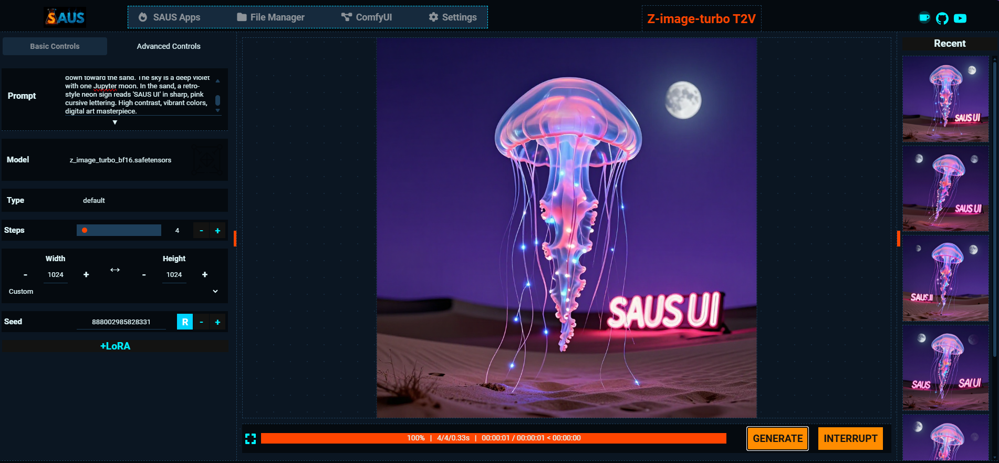
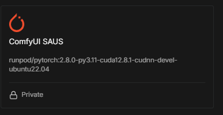

<a name="readme-top"></a>

<div align="center">

[](https://www.youtube.com/@koalanation/videos)
[](https://ko-fi.com/koalanation)


  
  <h3 align="center"><strong>S</strong>imple <strong>A</strong>pp <strong>U</strong> <strong>S</strong>ee</h3>
    <p align="center">
    <strong>Cut the spaghetti. Cook it with <i>Saus</i></strong>
  </p> 
  <p>
    <a href="docs/USER_GUIDE.md"><strong>User Guide</strong></a>
    <br />
    <a href="https://github.com/dsigmabcn/ComfyUI-SAUS/issues">Report Bug</a>
  </p>
</div>

<!-- TABLE OF CONTENTS -->
<details>
  <summary>Table of Contents</summary>
  <ol>
    <li><a href="#about-saus">About SAUS</a></li>
    <li><a href="#how-to-use-saus">How to use SAUS</a></li>
    <li><a href="#installation">Installation</a></li>
    <li><a href="#accessing-saus">Accessing SAUS</a></li>
  </ol>
</details>

# About SAUS

SAUS is a streamlined interface for AI Image and Video Generation using ComfyUI as backend Engine. 
"Spaghetti" node workflows converted into a clean, production-ready application environment.

## Why SAUS?
* **Simple:** Built for creators who need results without the node-induced headaches.
* **App:** A powerful wrapper that extends ComfyUI's capabilities into a standalone-app feel.
* **U See:** A clean, expansive "view" of your creative output—not just your backend.


<p align="right">(<a href="#readme-top">back to top</a>)</p>

## What is SAUS?

SAUS is a custom node for comfyui that works as a robust and simple User Interface to run different workflows, without messing and tinkering with all the spaghetti, parameters and options.

ComfyUI is powerful for designing and understanding AI generation, as it lets you see 'inside' the process and tweak every parameter. However, this flexibility can also lead to complex and challenging workflows. SAUS simplifies this by converting popular and powerful workflows into 'apps'. These apps provide a clean user interface, allowing you to focus on creativity by adjusting only the most important parameters.




## How to use SAUS

For instructions on how to use the interface, check out the [User Guide](docs/USER_GUIDE.md).


<p align="right">(<a href="#readme-top">back to top</a>)</p>

# Installation

## Requirements - ComfyUI and ComfyUI-Manager
 - [ComfyUI](https://github.com/comfyanonymous/ComfyUI)
 - [ComfyUI-Manager](https://github.com/ltdrdata/ComfyUI-Manager)

For detailed instructions on how to install ComfyUI and ComfyUI-Manager, please refer to [ComfyUI Installation Instructions](docs/ComfyUI_install_instructions.md).

### Recommended Custom nodes

I have tried that most of the apps work with native nodes only, but some use custom nodes. It is recommended to add the following custom nodes:
- [comfyui_controlnet_aux](https://github.com/Fannovel16/comfyui_controlnet_aux): for to generate controlnet preprocessed video
- [KJ Nodes](https://github.com/kijai/ComfyUI-KJNodes): quality of life nodes by kijai
- [ComfyUI_essentials](https://github.com/cubiq/ComfyUI_essentials): quality of life nodes by cubiq (Matteo), currently in maintenance mode
- [ComfyUI-RMBG](https://github.com/1038lab/ComfyUI-RMBG): To remove background from images
- [ComfyUI-AnimateDiffEvolve](https://github.com/Kosinkadink/ComfyUI-AnimateDiff-Evolved): if you plan to use AnimateDiff
- [ComfyUI-GGUF](https://github.com/city96/ComfyUI-GGUF): To use quantized models

## From ComfyUI Manager

If you already have installed [ComfyUI](https://github.com/comfyanonymous/ComfyUI) and [ComfyUI-Manager](https://github.com/ltdrdata/), the easiest way is to do it via the Manager.

Also search and install the custom nodes indicated in requirements.

## Manual Install

It is required to you have git installed. 

1. Navigate to the `custom_nodes` folder inside your ComfyUI installation.
2. Open a terminal (or type `cmd` in the address bar on Windows).
3. Run the following command:

```bash
git clone https://github.com/dsigmabcn/ComfyUI-SAUS.git
```
Make also sure the custom nodes indicated in requirements (and their dependencies in requirements.txt) are installed.

## Automatic Install (scripts)

To simplify installation, we provide scripts for Windows and Linux that install SAUS and the recommended custom nodes automatically.

The SAUS installers consider you already have [ComfyUI and ComfyUI-Manager already installed](docs/ComfyUI_install_instructions.md).

### Windows (Portable Version)

1. Download the **[install-saus-windows.bat](install-saus-windows.bat)** script from this repository.
2. Place the file in your **ComfyUI_windows_portable** directory (the folder containing `run_nvidia_gpu.bat` and the `ComfyUI` folder).
3. Double-click `install-saus-windows.bat` to run it.

### Linux
Git needs to be installed in your system. If you do not have it

```bash
sudo apt install git-all
```

1. Download the **[install-saus-linux.sh](install-saus-linux.sh)** script from this repository.
2. Place the file in your **ComfyUI** root directory (the folder containing `custom_nodes`).
3. Open a terminal in that directory.
4. Make the script executable and run it:
   ```bash
   chmod +x install-saus-linux.sh
   ./install-saus-linux.sh
   ```

## Runpod - pods
Runpod offers rental of GPU's at a good price that can be used to run the latest image and video models. This is convenient as you do not need to keep grinding and optimizing workflows to get a sub-optimal quality in your results.

After signing up in Runpod, create a Network Disk (with enough capacity to run the models) and use the ComfyUI SAUS template.



> [!NOTE]
> The template uses pytorch 2.8, the pod should have CUDA 12.8 or higher

> [!WARNING]
> If you already have ComfyUI in a Network Drive installed, the template will not install the custom node. Install it first via the manager, then later you can use the template to access the right ports.

<p align="right">(<a href="#readme-top">back to top</a>)</p>

# Accessing SAUS 

## 1. Direct Link

To run SAUS, simply navigate to this address in your web browser:

```
http://127.0.0.1:8188/saus
```
## 2. in ComfyUI
Click over the SAUS button in the action bar of ComfyUI


## 3. in Runpod
After start (and installation) of a pod with the ComfyUI SAUS template, SAUS is accessible in port 7771. This is visible in the HTTP services in the Pod control panel, and can be accessed by clicking there.

Alternatively, open ComfyUI and click on the SAUS button

<p align="right">(<a href="#readme-top">back to top</a>)</p>

# Credits

* [ComfyUI](https://github.com/comfyanonymous/ComfyUI)
* [ComfyUI-Manager](https://github.com/ltdrdata/ComfyUI-Manager)
* [distyFlow](https://github.com/disty0/distyFlow)