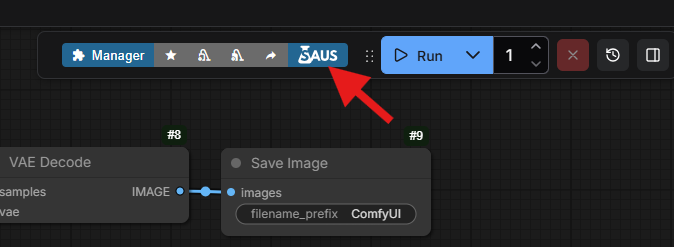

# SAUS UI User Guide

Welcome to the SAUS UI user guide. This document provides instructions on how to navigate and use the interface effectively.

## Accessing the Interface

### 1. Direct Link

To run SAUS, simply navigate to this address in your web browser:

```
http://127.0.0.1:8188/saus
```

or by clicking on the SAUS icon on the menu bar in ComfyUI.


## Interface Overview

### Home & Sidebar
- **Home**: The landing page where you can see an overview of how to generate AI images or videos.
- **Sidebar**: Use the sidebar to navigate between different categories of Apps (workflows).
- **Top Navigation Bar**: Use it to navigate between the SAUS Apps, the File Manager, ComfyUI, and the Settings Page.

### App Browsing
- **Search**: Use the search bar to find specific Apps by name.
- **Filters**: Filter Apps by type (Open, Gold, Beta, User), favorites, or sort them alphabetically.
- **Tags**: Click on tags to filter Apps by specific categories (e.g., base/quantized, model, function).

### Installing/Uninstalling Models
- **Model Status**: When selecting a category, the cards show if the required models are installed. 
- **Information Panel**: Click on the (i) button to access the information panel and install the required models for the App.
- **Installing Models**: If a model is missing, it is indicated with a red 'Missing' badge. Click on the Install button below to install the model.
- **Uninstalling Models**: If a model is not used by any App, you can delete it by clicking on 'Uninstall'.

## Running an App

1. **Open an App**: Open an App by clicking on the image of the card or the 'Open App' button in the information panel.
2. **Configure Parameters - Basic**: Adjust the available settings (prompts, image size, seed, etc.) in the simplified interface.
3. **Configure Parameters - Advanced**: Some Apps allow you to tune other advanced settings (CFG, sampler, scheduler, etc.).
4. **Configure Parameters - Masking**: Inpainting Apps have additional controls to draw a mask over the image you want to inpaint.
5. **Generate**: Click the "Generate" button to start the generation process. Click on "Interrupt" to stop the generation.
6. **Live Preview**: Watch the progress and see the result in the preview window.
7. **Recent**: See the images you have generated earlier (in the same session) by clicking on the images in the Recent panel.


## Tools (Naviation Bar)

## SAUS Apps
Return to the App Browsing page.

### File Manager
A simple File Manager to access and perform basic management of the files in your ComfyUI installation.
- **Favorited Folders**: Shortcut access to the 'Input', 'Output', and 'Models' folders inside ComfyUI.
- **Upload File**: Upload files and models to your local machine/ComfyUI installation.
- **Download from URL**: Download using a link, with the possibility to use API tokens (e.g., for gated CivitAI or Hugging Face models).
- **Folder Navigation**: Click on folders to navigate into them, and use 'Go Up' to move one level up in the directory structure. Access is limited to the ComfyUI folder.
- **Image Visualization**: Click on an image or video file to open a preview panel and view it.
- **File Management**: Use the icons on each file to rename, download, or delete it.

### ComfyUI
- **ComfyUI**: Open ComfyUI in a separate window.

### Settings
- **Civitai/Hugging Face API Tokens**: Securely store your API tokens for services like Civitai and Hugging Face. These tokens are used when downloading models that require authentication.
- **SAUS Token**: Required to access the 'Gold' and 'Beta' Apps/workflows.
- **Sync Private Apps**: When the SAUS token is saved, this button appears. Use it to download the 'Gold' and 'Beta' Apps. A restart is required after downloading.
- **Restart Server**: Restart the ComfyUI server directly from the UI if needed (e.g., after installing new custom nodes or updates).

**Disclaimer**: API tokens are stored encrypted in your local installation. However, you are responsible for ensuring their security. If you are unsure about the security of your system, do not use the API token functionality or save your keys.
