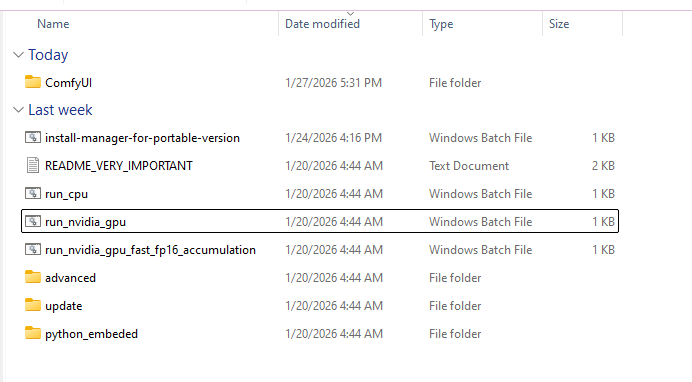

# Accessing SAUS

[Return to User Guide](USER_GUIDE.md)

## 1. Direct Link (ComfyUI Portable)
When you start ComfyUI Portable, you will normally access it as you do with ComfyUI.



In the command window, you will see that ComfyUI-SAUS is downloading/updating the apps and initializing. 


ComfyUI will open normally. You can access SAUS by adding `/saus` to the end of the ComfyUI address:
```
http://127.0.0.1:8188/saus
```


## 2. From ComfyUI graph
Start ComfyUI as indicated before. In the action bar on your top right, you will see the SAUS button. Just click on it to open the interface


## 3. From Runpod
If using the SAUS template, access via port 7771 or through the ComfyUI interface.

When the pod starts, Runpod automatically opens the panel, where you just need to click on port 7771:


During installation it may take a while. In second and subsequent runs it will take much shorter. Nevertheless, it is always good to check on the logs to see where the process is:


And in case that you navigate away, just click over the pod you have created and the panel will show up again:

[Return to User Guide](USER_GUIDE.md)
