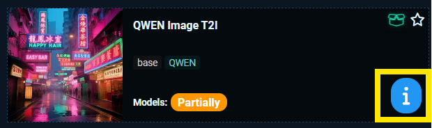
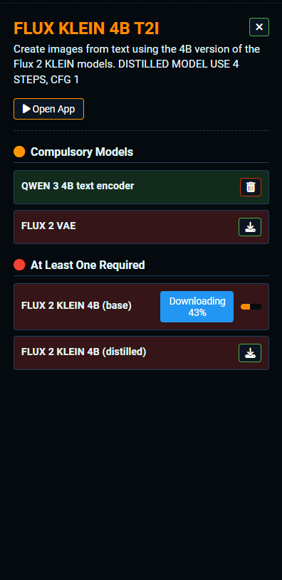

# Managing Models for Apps

[Return to User Guide](USER_GUIDE.md)

Before running a SAUS app, the required models need to be installed. The models are placed in specific subfolders within the 'models' folder in ComfyUI so that the apps know where to find them. 

In case you already have the models but they are placed in a different folder, you can still open the app and select the model file there.

## Model Status
To know if the models required to run an app are installed, you can check the status indicated on the app card:

If the models are Installed, you can go ahead and open the app (click over the thumbnail).

If the models for the app are Partially or Missing, you will need to install them. To do that, hover over and click the information button on the card in the bottom right.

An information panel will appear on the right of the screen:

Some models (typically VAEs and text encoders) are used by multiple apps, so you only need to install them once. This is why you might see the 'Partially' status even if you haven't downloaded any models for that specific app yet.

### App information
- **Title**: The title of the app.
- **Architecture**: The 'assembly' of models required. Different apps may have the same architecture (e.g., t2i and i2i variants).
- **Description**: A short description of the app. May include some specific instructions, e.g., to run distillation/lightning loras.
- **Open App**: By clicking on it, you can open the app (in a new window).

### Models

Below the App information, you will see several model (cards), showing if the model is Installed or Missing and a button to install/uninstall them.

The models are shown in three groups:
- **Compulsory**: These models are strictly required to run the app.
- **At least One Required**: In some apps, we can have some model versions or variants, so you only need to install one of them. For example, you can choose to use the Qwen Image model (original one) or the version 2512.
- **Optional models**: Typically distillation/lightning loras. You can run the app without them.

## Installing Models
If a model is missing (red 'Missing' badge), click the **Install** button below it to download and install.

## Uninstalling Models
If you want to free up space because you no longer use an app, you can delete its models by clicking **Uninstall**.

[Return to User Guide](USER_GUIDE.md)