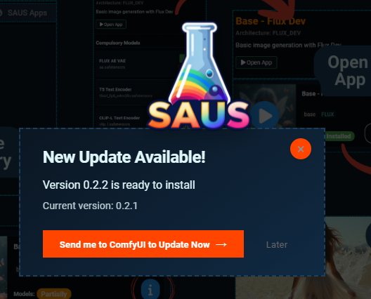
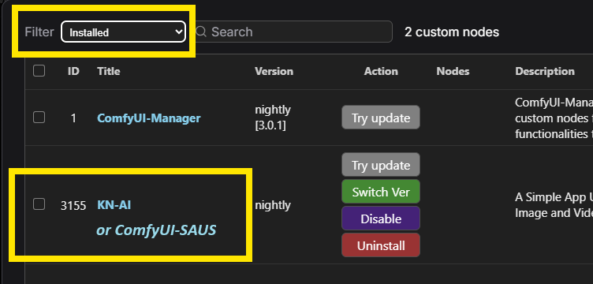
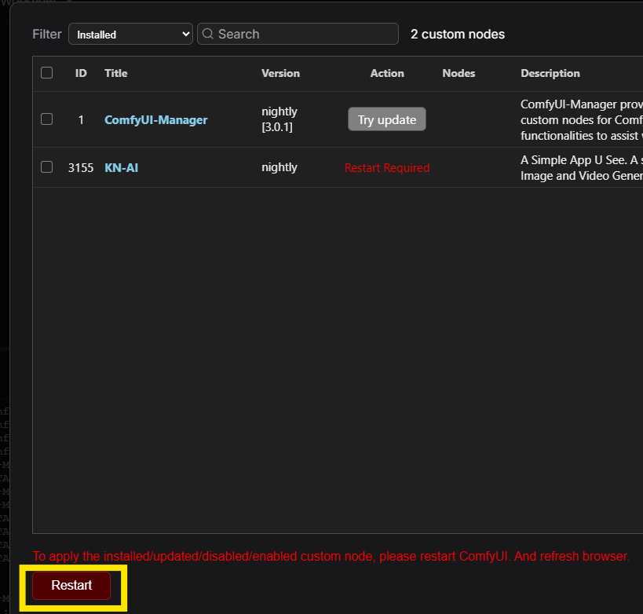

# General Navigation

In the landing page of SAUS you can identify these main elements:

## Sidebar
Use the sidebar to navigate between different categories of Apps (workflows) and Return to your home/landing page.
Check out: [App Browsing](APP_BROWSING.md)

## Top Navigation Bar
Navigate between:
- SAUS Apps: the landing/home page
- [File Manager](FILE_MANAGER.md): a simple manager for files in your ComfyUI installation 
- [ComfyUI](COMFYUI.md): access ComfyUI in a separate window
- [Settings](SETTINGS.md): save tokens for CivitAI, Hugging Face and SAUS for special apps

## Main Container:
In this section of the screen the apps, file manager or settings will be loaded.

## Updates:
If a newer version of the software is available, the 'updates' icon will appear. Click on it if you want to update it.

Click on 'Send me to ComfyUI to Update Now'. For the moment, the updates need to be done via the ComfyUI Manager. So when clicking, you will appear on the ComfyUI graph. To access the manager, you need to click on the 'Manager icon' in the action bar on your top right.

ComfyUI Manager will pop up. Access the Custom Nodes Manager:

The list of all the custom nodes available for ComfyUI will pop up. Now, filter by the custom nodes that are installed:

Look for the node number 3155 (check the name is KN AI or ComfyUI-SAUS - still registering properly the node).

Click then in 'Try Update' and the node will start being updated from github.

When the installation is complete, you will need to restart ComfyUI. You will see that the 'Restart Required' will appear as the action and you can do it by clicking on the button 'Restart' at the bottom.

After ComfyUI has restarted, refresh your browser (F5) and click again the SAUS button

[Return to User Guide](USER_GUIDE.md)
