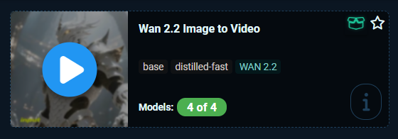
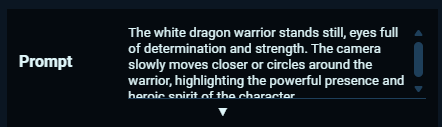
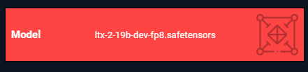
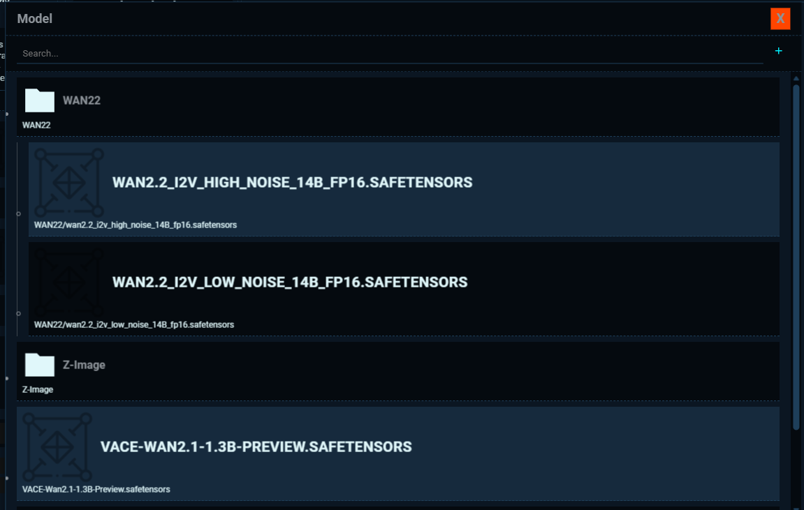
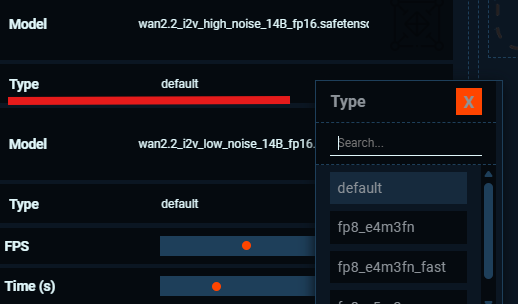
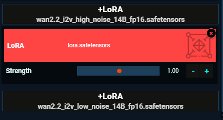
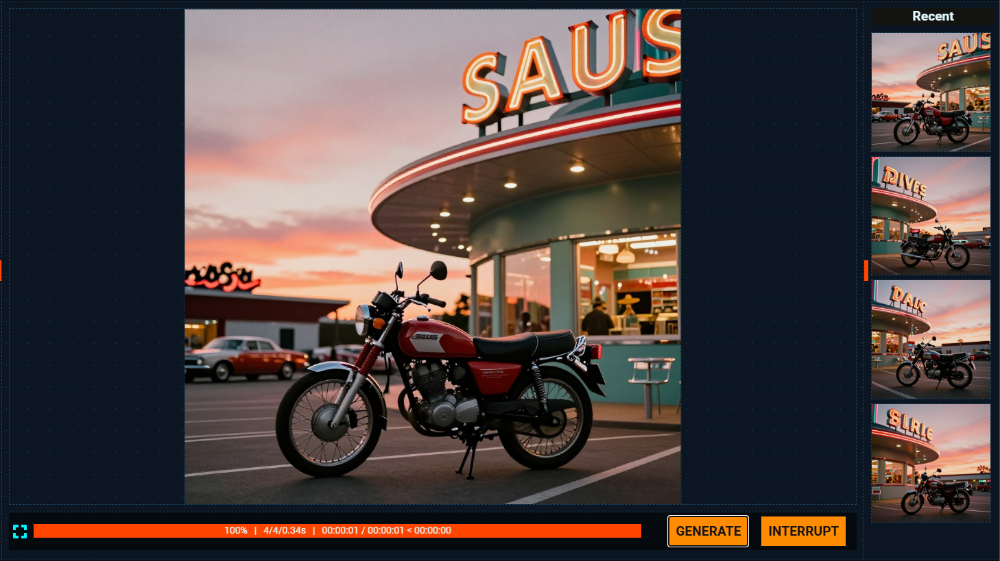

# Running an App

[Return to User Guide](USER_GUIDE.md)

## Open an App
After you have installed all models needed for an app, open the app by clicking on the image (a blue play button appears when hovering):

## Configure Parameters - Basic

Here you can adjust the basic controls for an app/workflow, which we discuss in more detail below.

### Prompt:
In the prompt box you describe the image or video that you want to generate.

You can enlarge the prompt text box by clicking on the triangle below the text box.

### Model

In this area the diffusion model or checkpoint to run image or video generation is selected. 
If you are installing the models using the control panel, these are already pre-loaded. 
However, if the model is missing, has a different name or it is located in a different folder than the default, it will be indicated in red:

By clicking on it, a new window pops up, that opens a navigation browser in the folder of where you can select the model you want to use:

As for the standard navigation for the models installed with SAUS: checkpoints and diffusion models of the same family are placed in the same subfolder. VAEs and checkpoints are not generally downloaded into subfolders, as they might be used for more than one image/video generation architechture

Click on the model you want to use and it will be loaded in the app.

> [!NOTE]
> Generally, there is one diffusion model per app, but Wan 2.2 uses two diffusion models, so the first one corresponds to the 'high' model, and the second for the 'low' model.

### Type:
SAUS typically download the fp16 or bf16 versions of the models in order to provide 'best quality' results and to be a tool as simple as possible. However, the VRAM of the GPU of the user might not be enough, in some cases (especially with the latest models, as they are pretty high). Thus, I wanted at least to keep the possibility for the user to 'downgrade' the weights to fp8, so they are easier to fit and run the app with less VRAM. 

If you want to run FP8, just click on it and a dropdown list with the available fp8 types is shown. Select the one you prefer (typically fo8_e4m3fm)

GGUF (quantized models) require of custom nodes and different app architecture, so they are not provided as part of the 'open' apps.

### Steps ###

For image generation models, you can define the number of steps for the KSampler (steps for the difussion/checkpoint model) to generate the image

### Image/Video Dimensions (width and height)

You can choose the different layouts:
- Square
- Landscape
- Portrait
- Custom

With custom you can define the width and height you want

The square, landscape and portrait dimensions have been selected as 'typical' case resolution of each model, based in their documentation and best practices.

### FPS and Time (s)

In video models you have the option to define the frames per seconds (FPS) and the time (in seconds) that you want.

Be aware of the limitations of each model in respect to these parameters. They have some flexibility, but typically they are limited.

### Seed

The seed is displayed at the bottom and can be changed as you want, by typing the desired seed number or by using the `+` or `-` buttons.

By default, the seed is random and it changes after you run the image/video generation. Next to the number is the 'R' (randomizer) button. 
- Click on it to generate a random number.
- Click and hold for a couple of seconds to convert your seed from random to fixed. When fixed, your seed will not change after you run the generation. - Click and hold again to convert it back to random.

### Lora
At the bottom, you will see a 'Lora' button, which allows you to use LoRAs.

When you click on it, a LoRA model selection widget will appear. Typically, this will be shown in red, as you need to indicate which LoRA model you want to use. 

As with model loading, just click on it, and a pop-up window with the content of your LoRA folder will appear. Navigate and select the LoRA you want to use. If the app accepts distillation LoRAs, they will appear here.

Below the lora model, you have the strength slider, where you can set the strength between 0 an 2 (default is 1, typically is in the range of 0.5-1)

If you do not want to use the lora anymore, click on the 'X' button on the corner

> [!NOTE]
> As for the models, the Wan 2.2 app has 2 lora buttons that can be used for the Lightxv2 models. The first one corresponds to the first model (high), and the second for the second model (low).

### Image (Video) Loader
For Image-to-image or image-to-video apps, you will need to use a reference image, which can be loaded into the 'input' folder of ComfyUI:

You can add an image by:
- Drag and drop an image over the image space
- Double clicking over the image space
- Click over 'Image Loader' to open the 'input' folder and select the image you want to use

After dropping the image or selecting it from local or input folder, the image will be loaded and ready to be used in the app for transformation, editing or as reference.

In the case of video-to-video and other tools, you can also add videos.

### Mask Settings
For inpainting apps, you have to work with masks. These apps will show a Mask Settings editor over the canvas, which allows you to choose the mask color, size, blur, etc.

At the bottom, you have a series of buttons to load the image you want to inpaint, zoom in/out, move the image, resize, undo/redo, etc.

After uploading the image, just click on the 'mask' button and start drawing the mask over the image.

## Generate (image or video)

At the bottom right you can see the 'Generate' button. When your basic settings are defined, you can just click and start generating the image.

After generating, the small gears will start rotating, and next to the progress bar you can see which nodes are being processed in the ComfyUI background. When the sampler starts, you will also see the progress bar progresssing with the number of steps.

Take into account that the models need to be loaded, so depending on how 'heavy' your model is, this will take more or less time. If you want to see more details, you can access the ComfyUI console logs by clicking over the 'gear' icons, which may provide some more information of the progress of the workflow

If you want to stop the generation process, just click the 'Interrupt' button, and the sampling will stop.

## Image visualization and Recent images

When the image or video generation process is finished, you can see the results:

The images or videos can be seen here and can also be downloaded by right-clicking and selecting 'Save As'. All images and videos are saved in the 'output' folder of ComfyUI, which you can access with the File Manager.

On the right, there is the 'Recent' panel, which shows the images that have been generated in the current session. You can navigate and open them to compare with the latest generation. The 'Recent' panel will not show generated images from previous sessions, so to see them you will need to access the File Manager.

## Advanced Controls

Next to the 'Basic Controls' tab, you can activate the 'Advanced Controls' tab to access some advanced settings.

The available controls will depend on the app you are running, but some common ones are:

- **CLIP and VAE**: if you want to use different text encoder or VAE models, you can select them here.
- **Sampler and scheduler**: you can change the sampler and scheduler for the diffusion process here.
- **Number of steps and CFG**: in the advanced settings, you can also change the number of steps for the diffusion process and the Classifier-Free Guidance (CFG) value. In general, the default values are good, but if you are going to use **distilled or lightning LoRAs**, you will need to change them, normally by **reducing the steps to 4-8** (depending on the LoRA) and the **CFG to 1**.

[Return to User Guide](USER_GUIDE.md)